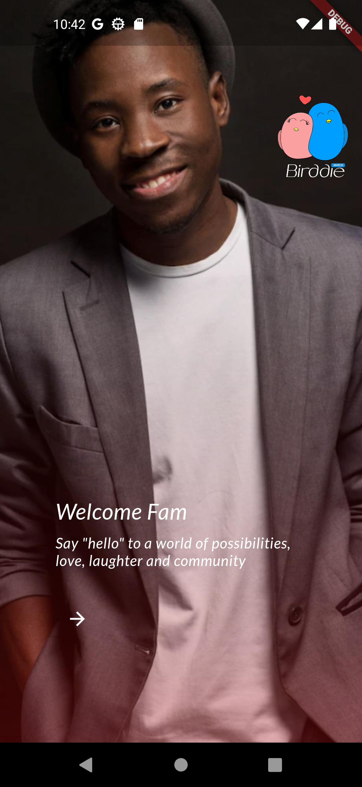
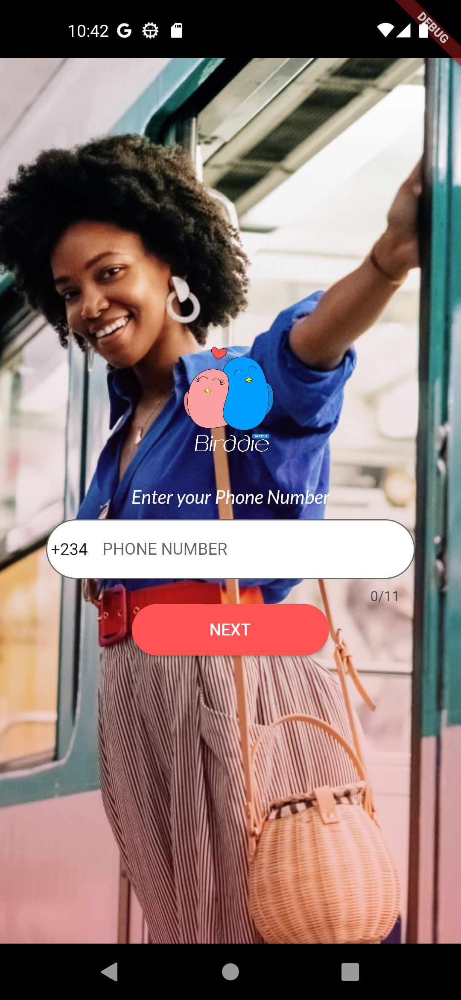
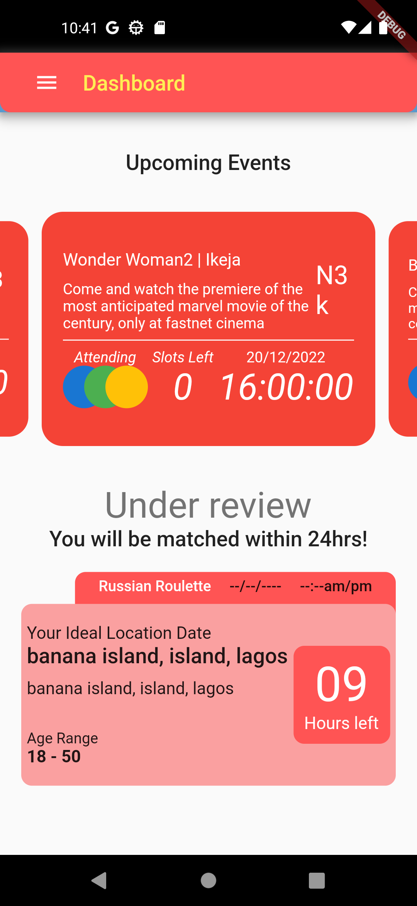
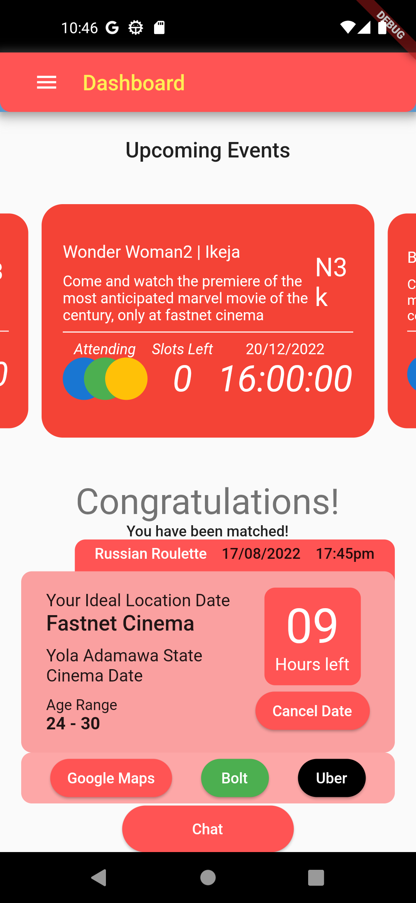

# birddie

Dating Social Media App

## About

This is a dating social media application made with:

* Flutter
* Provider State Management
* Mongo DB
* Firebase
* Figma

Users have the ability to sign in/login with their phone numbers, create an account with the information required and then proceed to the dashboard where they will be able to upload other needed information and proceed to the dashboard, where they will be able to create a "RUSSIAN ROULETTE". This will enable them to be matched with other users whose roulette matches theirs. A lit of the features are:

* User Login/Signup
* Dashboard Navigation
* Create Russian Roulette
* View and reserve slots for events in the application
* Chat with the matched user
* View matched user location on date day

## App Pictures

These are some screenshots from the mobile application:

Onboarding Screen          |  Login Screen
:-------------------------:|:-------------------------:
  |  

Review Russian Roulette          |  Accepted Russian Roulette
:-------------------------:|:-------------------------:
  |  
